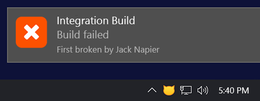

# CatLight Jenkins notification plugin

The [CatLight](https://catlight.io) app will show desktop notifications when builds, releases, pull requests, and tasks need your attention. The app will display an overall status in the tray to remind you about open action items.

Use this extension to [enable accelerated notifications for Jenkins](https://catlight.io/kb/i507-how-to-configure-accelerated-notifications-for-jenkins).

# Why use CatLight?

| Benefits for Developers | Benefits for Managers |
|------|---------|
| [Stay on top of your work](https://catlight.io/a/features-benefits-developers#stay-on-top) | [Improve team productivity](https://catlight.io/a/features-benefits-managers#improve-productivity) |
| [Have more stable CI/CD pipelines](https://catlight.io/a/features-benefits-developers#stable-cicd) | [Automate work prioritization](https://catlight.io/a/features-benefits-managers#automate-work-prioritization) |
| [Get your pull requests reviewed sooner](https://catlight.io/a/features-benefits-developers#get-prs-reviewed-sooner) | [Resolve CI/CD blockers faster](https://catlight.io/a/features-benefits-managers#resolve-cicd-blockers) |
| [Stay focused and reduce distractions](https://catlight.io/a/features-benefits-developers#stay-focused) | [Reduce interruptions for the team](https://catlight.io/a/features-benefits-managers#reduce-interruptions) |

# Build job notifications
You can select what Jenkins builds projects to monitor in the app, and CatLight will alert you about important events.

## Notifications on build start and completion

New build notifications will show an estimated completion time.

## Build job failure notifications
For failed build notifications, CatLight will show who broke the build first.

Read more about [build monitoring for Jenkins](https://catlight.io/a/jenkins-build-job-notifications)

## See the status in the tray

The CatLight tray icon will change color depending on the CI/CD pipeline status. If it is yellow or red, then there is an action item that needs your attention.

The tray icon will also change color when you have failed release pipelines, unreviewed pull requests, or urgent bugs. It will remind you about open action items, even if you have missed the notification.

## Dashboard - personal action center
CatLight will collect all alerts about the builds, releases, PRs and work items, and show them as a prioritized action list on the dashboard.

You can customize prioritization rules, so that developer can handle those items from top to bottom.

The app will display additional context about each item, for example, it will show who broke the build first, and whenever anyone is investigating why it broke down.

The watch list panel will show the build projects that you have recently started, as well as outgoing PRs and tasks. Use it to keep an eye on things that you're waiting for.

# Pull requests notifications and reminders
With CatLight, you can get notifications about new pull requests from GitHub, GitLab and Azure DevOps. Learn more about:
* [GitHub pull request notifications and reminders](https://catlight.io/a/github-pull-request-reminders-notifications)
* [Azure DevOps pull request notifications](https://catlight.io/a/azure-devops/azure-devops-pull-request-notifications)
* [GitLab merge request notifications and reminders](https://catlight.io/a/gitlab-merge-requests-notifications-reminders)

When you have an open incoming pull request, CatLight will change the tray icon color to blue to remind you about the code review.

You can also see who is reviewing your PR right now on the dashboard.

# Work item and issue alerts
CatLight can monitor your existing issues queries, and notify you about changes in tasks and bugs.

Learn more about:
* [GitHub issue notifications](https://catlight.io/a/github-issues-notifications-reminders)
* [Azure DevOps work item notifications](https://catlight.io/a/azure-devops/azure-devops-work-item-notifications)

# Features

* Build investigations - notify your team that you are looking at the build
* Git branch monitoring - see separate build history for each git branch
* Build progress display
* Get notifications and progress for gated check-in builds
* Build screen - maximize CatLight window to get a real-time dashboard with build status
* CatLight can monitor multiple Jenkins servers,
  as well as other systems like GitHub, GitLab, Azure DevOps, TeamCity, Travis CI, Appveyor, and Jira.

# Get CatLight

## [Download CatLight](https://catlight.io/downloads)

The app runs on Windows, macOS, and Linux. CatLight is free for small teams and open-source projects.

## Issues

Report plugin issues to the issues tab in this repo.

For app issues, use [CatLight support portal](https://support.catlight.io)

## LICENSE

Plugin is licensed under MIT, see [LICENSE](LICENSE.md)

